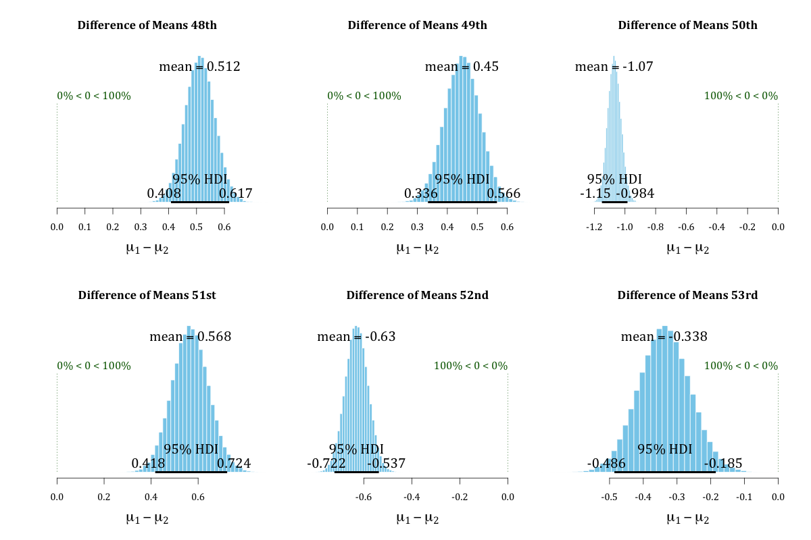
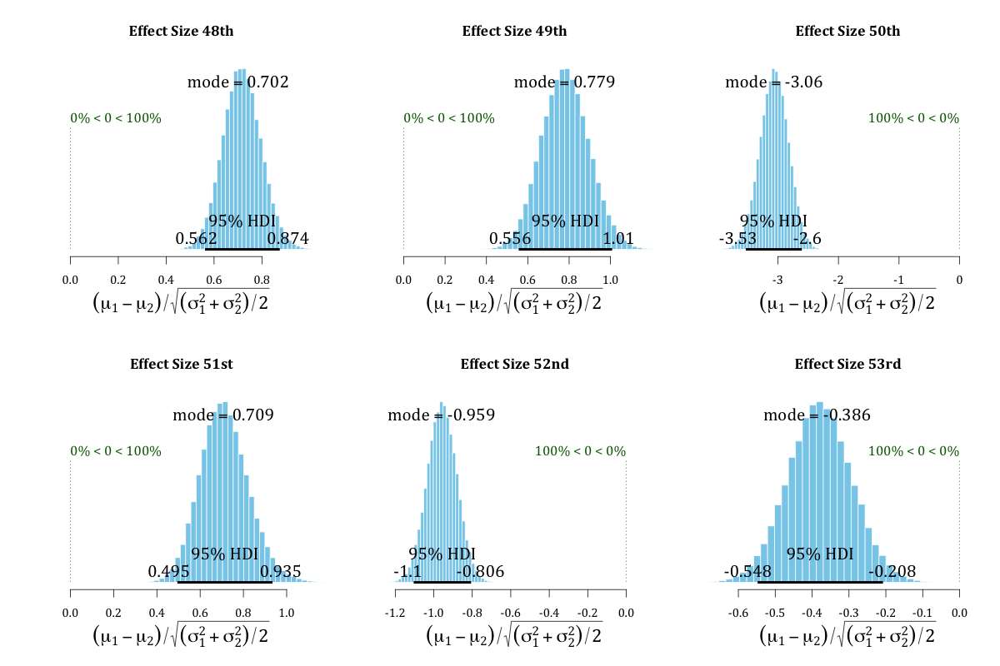

\newpage
When making formal comparisons of legislative arenas, there are methodological considerations that researchers must keep in mind. In this research note, I outline these concerns and demonstrate with an example how findings can change once these considerations are taken into account. By formal comparison, I mean quantitative estimates of legislative voting behaviour, such as ideal points. As the "primary use of roll call data [...] is the estimation of ideal points" [@Clinton:2004wr, p1], I focus on these particular estimates throughout this research note. The empirical example I use is a comparison of ideal point estimates from the Brazilian Chamber of Deputies and Federal Senate. The present study is part of a wider literature seeking to correct for measurement errors in latent variable models. Presently, the context is comparison, but scholars have endeavored to make improvements to measures of democracy [@Treier:2008aa], how changing standards affect measurements [@fariss2014respect], and to improve how we measure transparency [@hollyer2014measuring].  

Calling attention to the difficulties in making formal comparisons across legislative arenas or similar institutions is not new. @Bailey:2007uu and @Treier:2011co both highlight the misleading inferences that may result from comparisons of this sort when scholars do not include the methodological adaptations necessary. In fact, these adaptations are conceptually very simple. If we consider the basic Bayesian Item-Response Theory (IRT) model, employed in this context by @Clinton:2004wr and others, we can see clearly the basic requirements for making valid comparisons of different institutions. This model may be written as:
$$P(y_{ij} = 1) = \Phi(\beta_jx_i - \alpha_j)$$

where $y_{ij}$ is a matrix of recorded nominal votes, with $i$ indexing legislators and $j$ votes, in which $y_{ij} = 1$ indicates that legislator $i$ voted 'yes' on proposal $j$, and $y_{ij} = 1$ otherwise. $\Phi$ is the cumulative normal distribution function, leading to a probit regression model. $\beta$ is the 'discrimination' parameter of the model and $\alpha$ the 'difficulty' parameter; $x_i$ is the ideal point of legislator $i$, which may be understood as his/her preferred location in the policy space, a space of usually of one or two dimensions [@Jackman:2001tz]. In regression terms, $\alpha$ is the intercept and $\beta$ the slope; this is a latent regression model, as we only observe $y_{ij}$.
   
This model originally comes from the literature on educational tests, the context of which makes it very clear what is necessary in order to produce comparable ideal points. The model is designed to gauge the worth of an educational test, for example, on mathematical ability. The questions may range in terms of difficulty, and if individuals of varying aptitude in the latent trait (mathematical ability) answer the same questions in the same manner, these questions are unable to discriminate between the test-takers. That is, test-takers who have different levels of ability will have the same probability of answering the question correctly for questions with low discrimination parameter values. Questions that can separate individuals of differing capacity do discriminate between test-takers, and result in the model predicting that individuals of greater ability have a higher probability of answering correctly.

Although ideal points are not usually the main items of interest in this literature, with this model we can recover estimates of where the test-takers are positioned on the latent trait scale. For tests that discriminate well, we would expect to find those of limited mathematical skill at one end of the scale, while those with higher levels should be found at the other.

In the present context, the scale is constructed from the voting behavior of the legislators as compared to one another; two legislators who never vote the same way will be on the two extremes of the scale, for example, whereas those who vote similarly will be placed along the same region. The positions of the legislators on the scale are their ideal points. High absolute values of the discrimination parameter (above two or below minus two) indicate that the proposal separated the legislators; in other words, all the legislators do not vote in the same way for proposals with these high values. Conversely, values of this parameter that are close to zero indicate that all or most of the legislators voted the same way on such proposals.

It is obvious from this short description that test-takers must answer the same questions in order for their positions on the scale to be comparable. In the political context, we may not have the same control over what 'questions' (votes) legislators respond to, but this requirement remains the same. Hence, to compare two different institutions, both sets of legislators must respond to the same bills. Depending on the specific context, this may or may not even be possible. It also may not be justifiable: legislators in different houses may vote on very different versions of the same bill, for example, and bills may be amended many times before arriving in one house from the other. With regard to time, analyses of ideal points usually take a single legislature as a unit of analysis. Extending the period of time may necessitate the need for a dynamic model, such as that of @Martin:2002tr.

To expand upon this theme, I use the example of a comparison of ideal points between the Chamber of Deputies and the Federal Senate in Brazil, with the dataset from CEBRAP Legislative Dataset. These two houses have been formally compared by @Freitas:2012uk, @Bernabel:2015aa and @Desposato:2006ui. @Desposato:2006ui utilizes the fact that deputies and senators vote sequentially in the National Congress to place both sets of legislators in a common space. This is the most valid method for doing so, and cleverly exploits a native feature of the Brazilian political system. However, as Bailey (2007) notes, votes must be coded as being the same item, as if they were the exact same question in an educational-testing context [@Bailey:2007uu, p. 440]; there is no evidence available that Desposato undertook this necessary step. Freitas et al. (2012) estimate ideal point means for both houses separately and then compare the means, which is not a valid method of formal comparison; Bernabel (2015) estimates ideal points for both houses separately, which is also invalid as a method of comparison, and although the study is offered as a descriptive piece [@Bernabel:2015aa, p. 106], this comparison is potentially quite misleading. For example, Desposato (2006) finds less party cohesion in the Senate when compared to the Chamber, whereas Bernabel (2015) finds the opposite – how are we to know which finding is correct?

To productively compare these houses, we must place both on a common scale, as noted by Bernabel (2015). In order to do so, we must know which proposals were voted on in both houses, and on which versions of the proposals the houses voted, and which are common to both houses. Exactly how to do so will differ on the specific context. In the current example, we can exploit the common votes in the National Congress and use these votes as a means to 'bridge' between the two houses. These votes are coded as being the same item in the database and therefore the two sets of legislators are linked by their voting on these common votes. The analysis may then proceed using all the remaining votes from both houses in one common dataset.

This method is the same as that proposed by Desposato (2006), but leads to opposite findings. As mentioned previously, there is no evidence that Desposato (2006) treated the common votes in the National Congress as the exact same item, and I can only surmise that the difference in the findings presented here is down to this important detail.
The specific set of votes that were used to bridge the houses is that of the Medidas Provisórias (MPVs, Provisional Decrees) issued by the Executive and voted on in the National Congress. Many of these votes happened sequentially, although in a few cases the vote in the Senate happened at a later date (see Table 1). However, given that the voting is indeed sequential in the National Congress (Desposato, 2006), it is therefore not perfectly simultaneous, and this difference in time between the houses should not make any obvious difference. The Senators are aware of the result of the Deputies' votes in either case, and while it may be possible that the external political context shifted so rapidly as to change the probability of a 'yes' vote in the second house, this is unlikely for the small number of MPVs involved in the years analyzed (1989-2010). All other non-unanimous votes in both houses were then used in the normal manner, from one large conjoined dataset, once the bridging votes were coded as such.

There are of course other ways to bridge legislatures. One method is to use the legislators themselves, as in @shor2010bridge. In the Brazilian case, voting behavior could be analyzed over several levels of government – from municipalities to federal legislatures, and as such is an interesting avenue for future research, but not the focus of the present research note. Another method is to use the content of the votes themselves and thus code votes on the same proposal that occur in different time periods as a means to bridge over time, as in @bailey2015estimating; future studies on the dynamics of voting in both the Chamber and Senate could utilize this method.

Once we place the deputies and senators in a common space, we can meaningfully analyze hypotheses of differences between the institutions, operationalized by examining ideal point estimates from this common scale. Due to the large number of deputies, party means of ideal points instead of individual ideal points are considered below for both houses. Claims in the literature lead to several hypotheses, the first being *H1: there is no significant difference in voting behavior across the two houses*, as argued by Desposato (2006). This can be operationalized by examining the difference in means of the ideal points in both houses and the magnitude of the difference through a Bayesian version of the 't- test' for two groups [@kruschke2013bayesian].  
Some have posited differences in parties across the two legislatures, in particular that the PMDB, the 'Partido do Movimento Democrático Brasileiro', has differing factions depending on the house [@ZuccoJr:2011va]. Our second hypothesis is therefore *H2: there is a significant difference in party voting behavior across houses, in particular the PMDB*, which is operationalized in the same way as H1.
Desposato (2006) and Bernabel (2015) also disagreed on party cohesion within these legislatures, with the former finding more cohesion in the Chamber and the latter finding the opposite. This suggests *H3: parties in the Chamber are more cohesive than those of the Senate*. In order to examine this hypothesis, I will employ the same method as before, but with the standard deviations of party ideal points in the houses rather than party mean ideal points.  

\newpage

\captionsetup[table]{labelformat=empty}
```{r, message = F, warning = F, echo = F}
library(readxl)
tb <- read_excel("data/Table_A1.xlsx")
tb1 <- tb[1:20, ]
knitr::kable(tb1, format = "latex", caption = "Votes used as bridging proposals")
```

\newpage

\captionsetup[table]{labelformat=empty}
```{r, message = F, warning = F, echo = F}
library(readxl)
tb <- read_excel("data/Table_A1.xlsx")
tb1 <- tb[20:39, ]
knitr::kable(tb1, format = "latex", caption = "Votes used as bridging proposals (cont.).\nSource: CEBRAP Legislative Dataset")
```

\newpage 


It may also be the case that the Senate votes differently owing to its purpose [@Neiva:2013wz], its specific powers [@Neiva:2008le], the senior and perhaps conservative profile of the senators themselves (many are former presidential candidates, governors, party leaders and ex-ministers), or the high level of unelected suplentes (stand-ins) in the Senate [@Neiva:2012wd]; the hypotheses above will allow to establish if there is a difference in voting behavior between the Senate and the Chamber and its magnitude. These questions of why there is a difference are an important area for further research.
In order to test these hypotheses, I utilize methods detailed in Kruschke (2013), implemented in R with the BEST package [@Kruschke:2015rb. In the following discussion, I use the terms 'left' and 'right' as commonly understood, although the policy space could of course be another scale, such as government–opposition [@Izumi2012a].



Figure 1 shows the difference in means of ideal points for the two houses across all six legislatures studied. In each case, the Chamber is 'mean 1' ($\mu 1$). The histograms show the posterior probability distribution of the difference of the mean ideal point of the Chamber minus that of the Senate, with the 95% Highest Density Interval (HDI) displayed at the base of the histogram. Were the differences zero in any legislature, we would see that some part of any one of the histograms touches zero. As can be clearly seen, not only is this not the case, but all the distributions are quite some distance from zero. Hence Hypothesis 1 finds no support – voting behavior in the two houses is quite clearly different, with only Lula's second term in the 53rd legislature coming anywhere close to zero.

To assess the magnitude of this difference, we can examine the 'effect size' of the difference in these mean ideal points, which is the difference in the means of the two groups, taking into consideration the variation within the groups.^[For each combination of means and standard deviations, the effect size is computed as
$(\mu1 - \mu2)/\sqrt{(\sigma^2_1 + \sigma^2_2)/2}$. See Kruschke (2013, p. 08).] Figure 2 shows effect sizes for the six terms considered. Legislatures 48, 49 and 51 – the presidencies of Sarney, Collor, Franco and Cardoso – have effect sizes of close to 0.7, meaning that there is roughly a 76% probability that a deputy from these periods was to the right of a senator from the same period^[See @Coe:2002ef for the interpretation of effect sizes.]. Legislature 52, Lula's first term as president, displays an effect size of 0.955, meaning a probability of 82% that a deputy in this term was more to the right than a senator. The smallest effect size is to be found in Lula's second term (a roughly 62% probability), whereas the largest, an enormous -03.06, is found in Cardoso's first term, in which it is virtually guaranteed (99.9%) that a senator was more right-wing than a deputy of the same period. These effect sizes demonstrate that the findings of Desposato (2006), of no clear and consistent difference between the houses, cannot be supported.




Hypothesis 3 posits a difference in party behavior across the two institutions, with the literature paying particular reference to upper and lower house factions of the PMDB. Figure 03 plots the effect sizes of the differences in parties between the two institutions for the legislatures considered (the PT is plotted only in the 52nd legislature due to the low number of senators the party had before this period). As can be readily observed from the graph, the effect size for the difference in the PMDB across the two houses is the most moderate of the three large parties, with this pattern changing only in the 52nd legislature. Among the four parties graphed, the PFL is the one that seems most split between the houses, at least until the 52nd legislature. Hence hypothesis 02 receives support for all major parties except the PMDB.


The 'extremity' argument of Bernabel (2015), that senators within each party vote more for the party than deputies of the same party, is the inverse of Desposato’s (2006) claim that the parties in the Senate are less cohesive. One way to examine these arguments is to analyze the standard deviations of the t-test for a difference between the party means of both houses. Greater standard deviations translate to less cohesion, as the ideal points of the individuals in the party are more spread out in this case. The results are that there is exactly one instance of a party more cohesive in the Senate than the Chamber – the PFL in the 52nd legislature, supporting Desposato’s (2006) findings and contrary to those of Bernabel (2015). These results are shown in Table 02. Columns three and four show the spread of the 95% HDI for the posterior distributions of the standard deviations of the Chamber and Senate, respectively, and, as can be seen from a comparison of these two columns, parties in the Senate have a wider HDI; they are therefore less cohesive.
\newpage
\captionsetup[table]{labelformat=empty}
```{r, message = F, warning = F, echo = F}
tb <- read.csv("data/Table_1.csv")
tb <- tb[, 2:5]
knitr::kable(tb, format = "latex", caption = "Note: The PT are included for the 53rd legislature only due to the small number of Senators before this period.\nSource: CEBRAP Legislative Dataset")
```


## Conclusion  

I have shown in this research note how the results of a formal comparison between two legislative institutions can differ greatly depending on the methodology employed in making the comparison. Indeed, the findings presented here are in many cases the opposite of those in other studies. For methods such as ideal-point estimation, where we are creating scales of measurement, it is imperative that positions on such scales are made properly comparable in order for us to avoid the possibility of making incorrect inferences. It is also worth noting that the points raised here apply as well to studies that compare subsets of the voting database to the whole, for example, in the comparison of foreign policy voting with voting on domestic policy. As ideal-point research on legislative institutions grows in Brazil and other countries in Latin America, it is important that comparisons are properly made.  

Of course, the substantive question of why these differences exist between upper and lower houses is an interesting avenue for future research. Using the methodology espoused here, and in Bailey (2007), Treier (2011) and Bailey et al. (2015), will ensure that the comparisons we make are as accurate as possible.

 